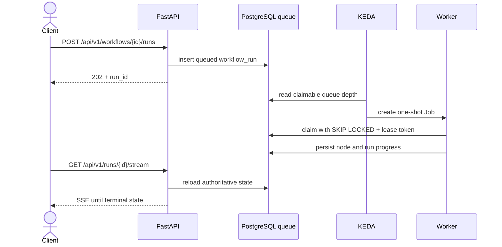
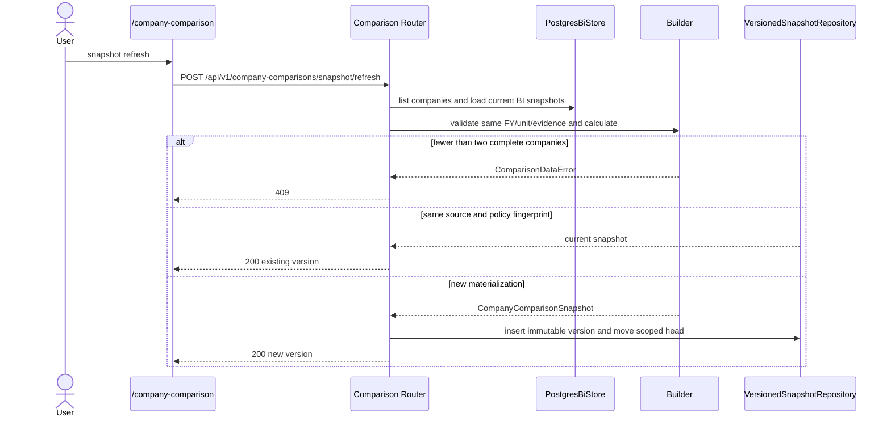

# [SEC-303] 주요 실행 시퀀스와 동시성 경계

> **Chapter:** 3. 시스템 아키텍처 및 상세 설계 | **Section:** 3.3 | **Status:** Implementation-aligned

---

## 1. Durable workflow 실행

Redis는 상태 변경 wake-up을 전달할 수 있지만 최종 상태는 항상 PostgreSQL에서 다시 읽습니다.

## 2. Company Comparison refresh

이 경로는 외부 LLM이 없는 짧은 결정론적 계산이므로 KEDA job으로 보내지 않습니다.

## 3. Lease 안전성

- 후보 claim은 `FOR UPDATE SKIP LOCKED`로 워커 간 경합을 피합니다.
- advisory lock은 동일 run의 동시 실행을 차단합니다.
- lease token과 heartbeat는 이전 세대 worker가 새 실행 결과를 덮어쓰지 못하게 합니다.
- stale lease는 설정된 임계값 이후 회수되고 queue로 복귀합니다.
- 소유권을 잃은 worker는 결과 저장 전 fail-closed 합니다.

정확한 간격·상태 전이·장애 런북은 [`BP-103`](file:///c:/Repos/bist-mini-final/docs/blueprints/01_system_blueprints/BP-103_concurrency_and_locking_model.md)를 기준으로 합니다.
