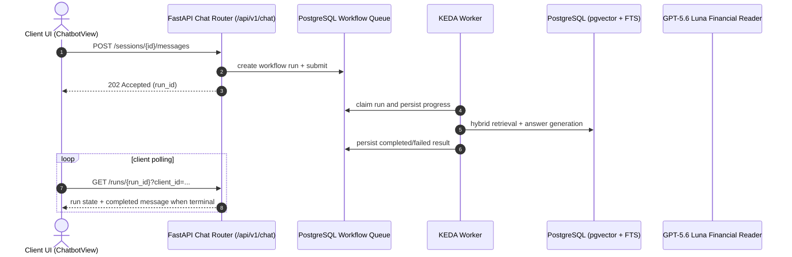
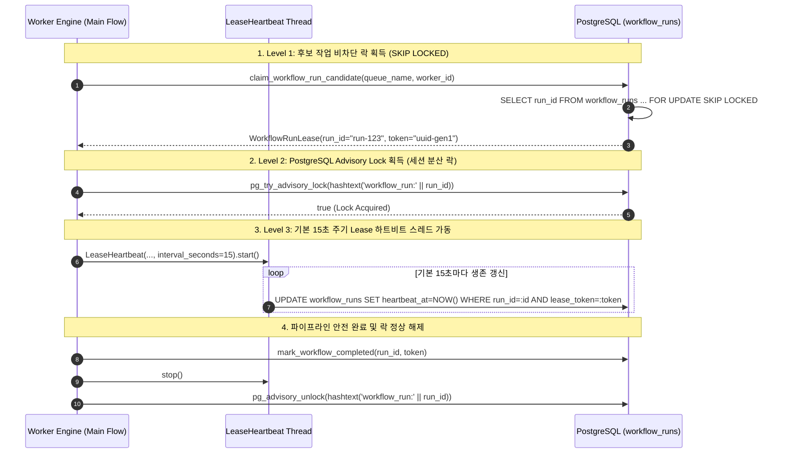

# [SEC-303] 동적 시퀀스 다이어그램 & 분산 동시성 런북
> **Chapter:** 3. 시스템 아키텍처 및 상세 설계 | **Section:** 3.3 | **Status:** Implementation-aligned reference
> **Classification:** Dynamic Sequence Diagrams, 3-Level Distributed Locking & Ops Runbook

---

## 1. AI 챗봇 Durable RAG 질의 시퀀스

RAG가 필요한 챗봇 메시지는 WebSocket으로 토큰을 전송하지 않습니다. 세션 메시지 API가 workflow run을 durable queue에 등록하고, 클라이언트는 run 조회로 결과를 동기화합니다.

---

## 2. 3-Level 동시성 안전 분산 락킹 시퀀스 (3-Level Distributed Locking)

Kubernetes 다중 워커 환경에서 작업 경합, 좀비 덮어쓰기 및 고아 작업을 방지하기 위한 3중 락 프로토콜입니다:

---

## 3. 분산 인프라 운영 런북 및 장애 복구 절차 (Ops & Disaster Recovery Runbook)

| 장애 시나리오 (Scenario) | 감지 메커니즘 (Detection) | 자동 복구 절차 (Automated Recovery Sequence) | 운영자 수동 개입 지침 (Runbook Action) |
| :--- | :--- | :--- | :--- |
| **워커 Pod OOM / 노드 장애** | 기본 15초 주기 하트비트 중단 ➡️ `heartbeat_at`이 기본 180초 stale 임계값 초과 | 1. PostgreSQL이 종료된 워커 세션의 `pg_advisory_lock`을 자동 해제. 2. 180초 경과 시 타 워커가 stale lease를 감지. 3. `reap_stalled_leases()`가 기존 토큰을 무효화하고 `status='queued'`로 전환. | k8s 워커 Pod의 메모리 리밋 증설 (`deploy/kubernetes/`) 및 `/jobs` 포털에서 큐 재유입 확인. |
| **PostgreSQL 일시적 연결 단절** | `psycopg2.OperationalError` 발생 | 1. 워커는 DB 업데이트 실패 시 `lease_token`을 상실한 것으로 간주하여 즉시 실행 중단. 2. 커넥션 풀이 지수 백오프(1s, 2s, 4s)로 재연결 시도. | DB 서버 리소스(CPU/메모리) 점유율 확인 및 `pg_stat_activity`에서 잔여 락 세션 점검. |
| **OpenAI Responses API 429 (Rate-Limit)** | ProviderApiError (HTTP 429) 반환 | 1. `BaseLLMModule`이 `Retry-After` 헤더를 파싱하여 최대 5회 지수 백오프 자동 재시도. 2. 재시도 초과 시 에러 엔벨로프 포장 후 큐에 재등록. | OpenAI 티어 할당량(TPM/RPM) 모니터링 및 KEDA 동시 워커 수 상한(`maxReplicaCount`) 조정. |
| **장기 실행 좀비 워커 발생** | 실행 시간이 `timeout_seconds` 초과 | 1. 워커 내부 비동기 타임아웃 트리거. 2. `cancel_requested=true` 플래그 감지 시 프로세스 안전 종료 및 롤백. | 워크플로 실행은 `POST /api/v1/runs/{run_id}/cancel`로 취소 요청합니다. `/jobs`는 현재 읽기 전용 관제입니다. |
