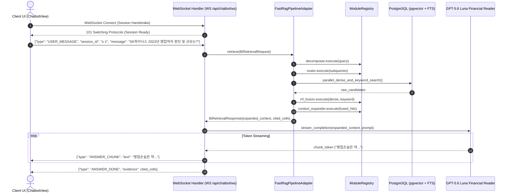
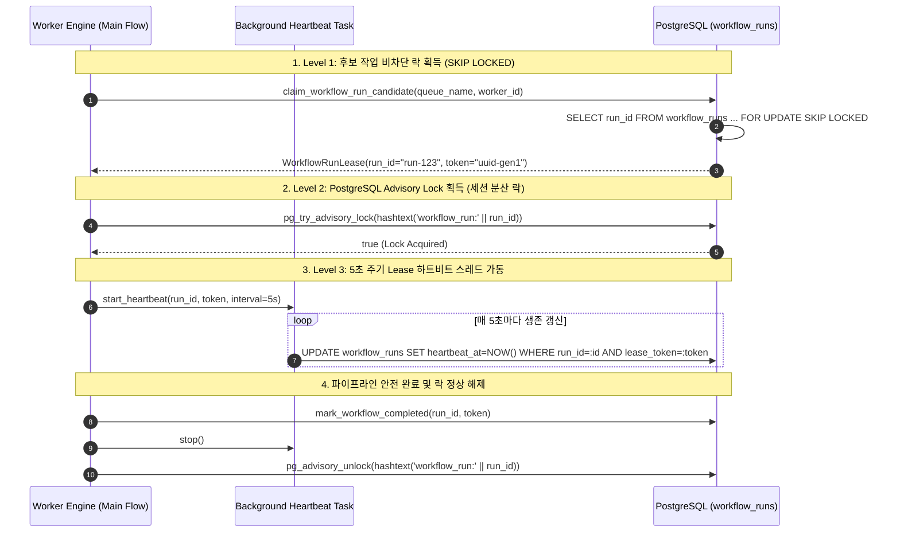

# [SEC-303] 동적 시퀀스 다이어그램 & 분산 동시성 런북
> **Chapter:** 3. 시스템 아키텍처 및 상세 설계 | **Section:** 3.3 | **Status:** Approved Baseline  
> **Classification:** Dynamic Sequence Diagrams, 3-Level Distributed Locking & Ops Runbook

---

## 1. Fast RAG 인메모리 실시간 질의 시퀀스 (Fast RAG Sequence Trace)

[`FastRagPipelineAdapter`](file:///c:/Repos/bist-mini-final/backend/features/bi/fast_rag_adapter.py)는 무거운 DAG 인프라 오버헤드 없이 인메모리 포트 바인딩을 통해 단 300ms 이내에 하이브리드 검색 및 확장을 완료합니다:

---

## 2. 3-Level 동시성 안전 분산 락킹 시퀀스 (3-Level Distributed Locking)

Kubernetes 다중 워커 환경에서 작업 경합, 좀비 덮어쓰기 및 고아 작업을 방지하기 위한 3중 락 프로토콜입니다:

---

## 3. 분산 인프라 운영 런북 및 장애 복구 절차 (Ops & Disaster Recovery Runbook)

| 장애 시나리오 (Scenario) | 감지 메커니즘 (Detection) | 자동 복구 절차 (Automated Recovery Sequence) | 운영자 수동 개입 지침 (Runbook Action) |
| :--- | :--- | :--- | :--- |
| **워커 Pod OOM / 노드 장애** | 5초 주기 하트비트 중단 ➡️ `heartbeat_at < NOW() - INTERVAL '30s'` | 1. PostgreSQL이 워커 세션의 `pg_advisory_lock`을 즉시 0초 해제. 2. 30초 경과 시 타 워커가 `STALLED` 상태 감지. 3. `reap_stalled_leases()`가 기존 토큰을 무효화하고 `status='queued'`로 전환. | k8s 워커 Pod의 메모리 리밋 증설 (`deploy/kubernetes/`) 및 `/jobs` 포털에서 큐 재유입 확인. |
| **PostgreSQL 일시적 연결 단절** | `psycopg2.OperationalError` 발생 | 1. 워커는 DB 업데이트 실패 시 `lease_token`을 상실한 것으로 간주하여 즉시 실행 중단. 2. 커넥션 풀이 지수 백오프(1s, 2s, 4s)로 재연결 시도. | DB 서버 리소스(CPU/메모리) 점유율 확인 및 `pg_stat_activity`에서 잔여 락 세션 점검. |
| **OpenAI Responses API 429 (Rate-Limit)** | ProviderApiError (HTTP 429) 반환 | 1. `BaseLLMModule`이 `Retry-After` 헤더를 파싱하여 최대 5회 지수 백오프 자동 재시도. 2. 재시도 초과 시 에러 엔벨로프 포장 후 큐에 재등록. | OpenAI 티어 할당량(TPM/RPM) 모니터링 및 KEDA 동시 워커 수 상한(`maxReplicaCount`) 조정. |
| **장기 실행 좀비 워커 발생** | 실행 시간이 `timeout_seconds` 초과 | 1. 워커 내부 비동기 타임아웃 트리거. 2. `cancel_requested=true` 플래그 감지 시 프로세스 안전 종료 및 롤백. | 필요 시 `/jobs` 관리자 콘솔에서 특정 `run_id`에 대해 강제 취소 명령(`POST /api/workflows/{id}/cancel`) 발행. |
