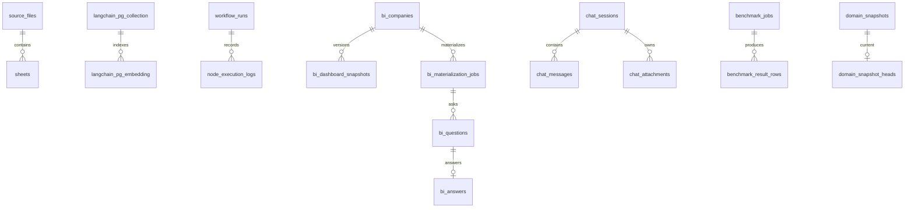

# [SEC-304] PostgreSQL·pgvector 물리 설계

> **Chapter:** 3. 시스템 아키텍처 및 상세 설계 | **Section:** 3.4 | **Status:** Implementation-aligned

---

## 1. 마이그레이션 기준

- Alembic head: `20260829_0005`
- `20260827_0001`: 기존 설치를 채택하는 schema baseline
- `20260828_0002`: source/BI company soft delete와 append-only audit
- `20260828_0003`: 불변 domain snapshot과 current head
- `20260828_0004`: head가 같은 domain·scope의 snapshot만 참조하도록 복합 외래키 강화

애플리케이션 테이블은 `alembic_version`을 제외하고 22개입니다. `20260829_0005`는 Excel embedding/vector COPY child Job의 durable queue인 `ingestion_shards`를 추가합니다.

## 2. 테이블 그룹

| 그룹 | 테이블 |
| :--- | :--- |
| Source·Vector | `source_files`, `sheets`, `langchain_pg_collection`, `langchain_pg_embedding` |
| Workflow | `workflow_runs`, `node_execution_logs` |
| BI | `bi_companies`, `bi_document_profiles`, `bi_materialization_jobs`, `bi_questions`, `bi_answers`, `bi_dashboard_snapshots` |
| Chat | `chat_sessions`, `chat_messages`, `chat_attachments`, `chat_suggested_questions` |
| Benchmark | `benchmark_jobs`, `benchmark_result_rows` |
| Generic snapshot | `domain_snapshots`, `domain_snapshot_heads` |
| Audit | `audit_logs` |

## 3. 핵심 관계

`bi_companies.current_snapshot_id`는 기업별 BI head이고, `domain_snapshot_heads(domain, scope_key)`는 Company Comparison 같은 도메인 결과의 head입니다. 두 head를 합치지 않아 BI refresh와 비교 정책 배포가 독립적으로 진행됩니다.

세부 컬럼·인덱스·DDL은 [`BP-503`](file:///c:/Repos/bist-mini-final/docs/blueprints/05_interface_blueprints/BP-503_database_erd_and_ddl.md)와 Alembic revision을 단일 기준으로 사용합니다.
