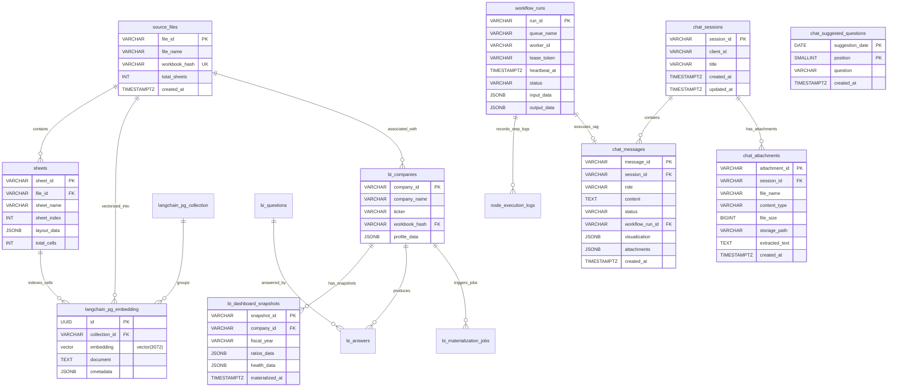

# [SEC-304] 데이터베이스 물리 설계 & 전사 정규 테이블 ERD
> **Chapter:** 3. 시스템 아키텍처 및 상세 설계 | **Section:** 3.4 | **Status:** Approved Baseline  
> **Classification:** Physical Database Schema, pgvector 3072d Vector DDL & Chat/BI/Workflow Tables ERD

---

## 1. PostgreSQL 16 + pgvector 전사 물리 ERD

---

## 2. 전사 핵심 테이블 물리 명세

| 도메인 카테고리 | 테이블명 | 주요 PK / FK | 핵심 컬럼 및 인덱스 | 역할 및 책임 |
| :--- | :--- | :--- | :--- | :--- |
| **Data & Vector** | `source_files` | `file_id` (PK) | `workbook_hash` (UK, SHA-256), `file_name` | 원천 엑셀 파일 메타데이터 및 무결성 관리 |
| | `sheets` | `sheet_id` (PK), `file_id` (FK) | `sheet_name`, `layout_data` (JSONB) | 2D 셀 좌표 및 VLM 바운딩박스 저장 |
| | `langchain_pg_collection` | `uuid` (PK) | `name` (UK, `excel-rag-3072`) | pgvector 임베딩 컬렉션 네임스페이스 |
| | `langchain_pg_embedding` | `id` (PK), `collection_id` (FK) | `embedding vector(3072)` (HNSW), `cmetadata` | 3072d Dense 벡터 및 셀 메타데이터 영구 저장 |
| **AI Chatbot** | `chat_sessions` | `session_id` (PK) | `client_id`, `title`, `updated_at DESC` (인덱스) | 사용자별 대화 세션 컨텍스트 관리 |
| | `chat_messages` | `message_id` (PK), `session_id` (FK) | `role`, `status`, `workflow_run_id`, `visualization` | 질의, 응답, 시각화 차트 JSON, 첨부파일 바인딩 |
| | `chat_attachments` | `attachment_id` (PK), `session_id` (FK) | `storage_path`, `file_name`, `extracted_text` | 대화 세션에 첨부된 엑셀/CSV 원천 데이터 |
| | `chat_suggested_questions` | `(suggestion_date, position)` (PK) | `question` | 기업/재무 지표 기반 스마트 추천 질문 |
| **Financial BI** | `bi_companies` | `company_id` (PK) | `workbook_hash`, `display_name`, `ticker` | BI 분석 대상 기업 프로파일 |
| | `bi_questions` / `bi_answers` | `question_id` / `answer_id` | `category`, `metric_value`, `evidence_cells` | 40+ 지표 질문/답변 및 감사 셀 좌표 매핑 |
| | `bi_dashboard_snapshots` | `snapshot_id` (PK) | `company_id`, `fiscal_year`, `ratios_data` | 무손실 `Decimal` 산출 40+ 비율 스냅샷 캐시 |
| **Workflow Core** | `workflow_runs` | `run_id` (PK) | `(queue_name, status, heartbeat_at)`, `lease_token` | 2-Tier DAG 실행 대기열 & 3-Level 분산 락 FSM |
| | `node_execution_logs` | `log_id` (PK), `run_id` (FK) | `node_id`, `status`, `latency_ms`, `token_usage` | 노드별 개별 지연시간 및 토큰 비용 로깅 |