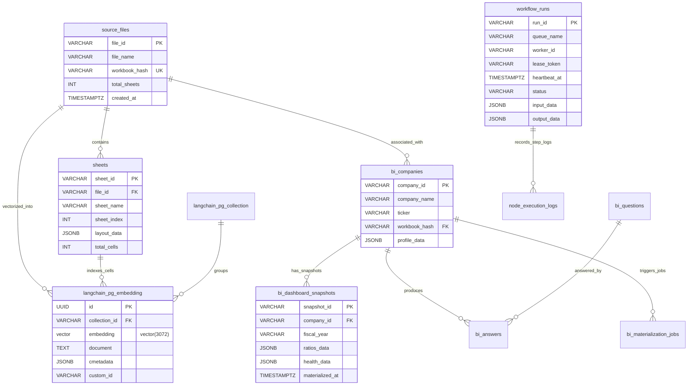

# [SEC-304] 데이터베이스 물리 설계 & 10대 정규 테이블 ERD
> **Chapter:** 3. 시스템 아키텍처 및 상세 설계 | **Section:** 3.4 | **Status:** Approved Baseline  
> **Classification:** Physical Database Schema, pgvector 3072d Vector DDL & 10 Relational Tables ERD

---

## 1. PostgreSQL 16 + pgvector 10대 정규 테이블 물리 ERD

---

## 2. 10대 정규 테이블 물리 명세 요약

| 테이블명 | 주요 PK / FK | 핵심 컬럼 및 인덱스 | 역할 및 책임 |
| :--- | :--- | :--- | :--- |
| **`source_files`** | `file_id` (PK) | `workbook_hash` (UK, SHA-256), `file_name` | 원천 엑셀 파일 메타데이터 및 무결성 해시 관리 |
| **`sheets`** | `sheet_id` (PK), `file_id` (FK) | `sheet_name`, `sheet_index`, `layout_data` (JSONB) | 시트별 2D 좌표, VLM 바운딩박스 레이아웃 저장 |
| **`langchain_pg_collection`** | `uuid` (PK) | `name` (UK, `excel-rag-3072`) | pgvector 임베딩 컬렉션 네임스페이스 관리 |
| **`langchain_pg_embedding`** | `id` (PK), `collection_id` (FK) | `embedding vector(3072)` (HNSW Cosine), `cmetadata` | 3072d Dense 벡터 및 셀 좌표 메타데이터 영구 저장 |
| **`workflow_runs`** | `run_id` (PK) | `(queue_name, status, heartbeat_at)`, `lease_token` | 2-Tier DAG 실행 대기열 및 3-Level 분산 락 상태 머신 |
| **`node_execution_logs`** | `log_id` (PK), `run_id` (FK) | `node_id`, `status`, `latency_ms`, `token_usage` | DAG 노드별 개별 실행 지연시간, 토큰 비용 로깅 |
| **`bi_companies`** | `company_id` (PK) | `workbook_hash`, `company_name`, `ticker` | BI 분석 대상 기업 프로파일 및 워크북 매핑 |
| **`bi_questions`** | `question_id` (PK) | `category`, `metric_key`, `question_text` | 40+ 전사 재무 지표 표준 질문 카탈로그 |
| **`bi_answers`** | `answer_id` (PK) | `company_id`, `question_id`, `metric_value` | 지표별 추출 원천 수치 및 감사 셀 좌표 바인딩 |
| **`bi_dashboard_snapshots`** | `snapshot_id` (PK) | `company_id`, `fiscal_year`, `ratios_data` (JSONB) | 무손실 `Decimal` 산출 40+ 비율 스냅샷 캐시 |
