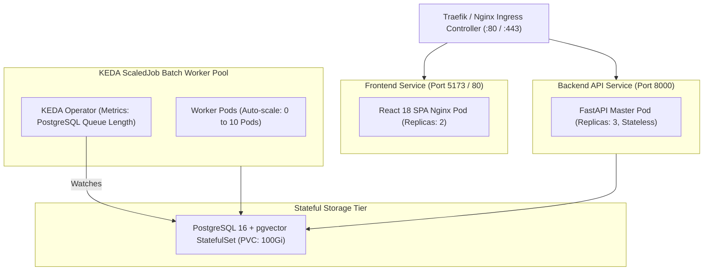

# [SEC-306] 인프라 토폴로지 및 배포 환경 (K8s & Docker)
> **Chapter:** 3. 시스템 아키텍처 및 상세 설계 | **Section:** 3.6 | **Status:** Approved Baseline  
> **Classification:** Infrastructure Topology, Kubernetes KEDA ScaledJob & Container Deployment

---

## 1. Kubernetes 분산 배포 토폴로지

`bist-mini-final`은 로컬 `k3d` 클러스터 및 엔터프라이즈 K8s 환경에서 자동 확장(Auto-scaling)을 지원합니다:

---

## 2. 하드웨어 및 소프트웨어 스택 명세

* **런타임 환경**: Python 3.11 (uv 가상환경), Node.js v20 (Vite)
* **데이터베이스**: PostgreSQL 16.2 with `pgvector 0.7.0` & HNSW Cosine Index
* **컨테이너 오케스트레이션**: Kubernetes 1.28+, KEDA 2.13+, k3d v5.6+