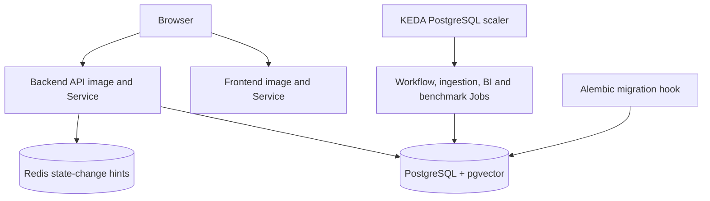

# [SEC-306] 인프라와 프로덕션 배포

> **Chapter:** 3. 시스템 아키텍처 및 상세 설계 | **Section:** 3.6 | **Status:** Implementation-aligned

---

## 1. 배포 단위

- API와 UI는 Docker image로 패키징합니다.
- `deploy/helm/bist/`가 Deployment, Service, Ingress, Redis, RBAC, migration hook, KEDA ScaledJob과 TriggerAuthentication을 렌더링합니다.
- `values.yaml`은 배포 기본값, `values-k3d.yaml`은 로컬 K8s 검증 overlay입니다.
- queue DB URL은 Kubernetes Secret과 TriggerAuthentication으로 전달하며 ScaledJob metadata에 평문으로 넣지 않습니다.

## 2. 실행 경로

| 경로 | 배포 방식 |
| :--- | :--- |
| API read·short calculation | FastAPI Pod. async PostgreSQL/provider 사용 |
| Workflow·BI materialization/question·benchmark | KEDA가 queue depth에 따라 생성하는 one-shot Job |
| Ingestion child batches | embedding 최대 4개, vector COPY 최대 2개 KEDA Job; 부모 barrier 뒤 HNSW/publish |
| Company Comparison refresh | API Pod의 짧은 결정론적 계산 후 PostgreSQL snapshot publish |
| Migration | 애플리케이션 rollout 전에 `alembic upgrade head` |

## 3. 로컬 실행

`deploy/kubernetes/local.sh`는 Docker·kubectl·Helm·클러스터·DB 연결을 사전 점검하고 k3d 또는 설정된 클러스터에 동일 배포 계약을 적용합니다. K8s 없이 개발할 때는 루트 README의 backend/frontend 실행 경로를 사용하며 `INGESTION_SHARDS_ENABLED=false` fallback을 유지합니다.

정확한 chart 값·환경 변수·preflight·운영 과제는 [`BP-104`](file:///c:/Repos/bist-mini-final/docs/blueprints/01_system_blueprints/BP-104_deployment_and_infra_topology.md)를 기준으로 합니다.
