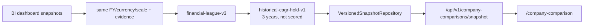

# [SEC-403] [3차 MVP 및 현재화] Chatbot과 Company Comparison
> **Chapter:** 4. 시스템 구현 및 MVP 진화 | **Section:** 4.3 | **Status:** Current Historical Record

---

## 1. Chatbot

Chatbot은 PostgreSQL 세션·메시지·첨부파일 저장소와 durable RAG run을 결합합니다.

- 세션 생성·조회·이름 변경·삭제
- 메시지 등록 후 workflow run 상태 동기화
- Excel/CSV 첨부의 제한된 text evidence 추출
- 일별 suggested question 저장과 refresh
- Markdown/LaTeX/inline chart 렌더링
- 답변에 사용된 source cell evidence 연결

현재 정식 namespace는 `/api/v1/chat`이며 이전 `/api/v1/chatbot`은 호환 경로로만 취급합니다.

---

## 2. Company Comparison의 교체 과정

초기 직접 DuPont 비교 화면과 별도 V2 frontend는 현재 계약에서 제거했습니다. V2의 유효한 UX를 `/company-comparison` 정식 화면으로 승격하고 백엔드에 독립 comparison API를 구현했습니다.

핵심 결과는 다음과 같습니다.

- BI와 comparison route·DTO·service를 분리했습니다.
- 성장성 35%, 수익성 35%, 안정성 30%의 고정 benchmark 점수와 competition rank를 사용합니다.
- 실제 관측값과 source cell evidence가 불완전한 기업은 `exclusions`에 기록합니다.
- 최소 2개 기업이 검증되지 않으면 publish하지 않고 409를 반환합니다.
- 예측은 versioned assumption으로 명시하고 순위 계산에 사용하지 않습니다.
- `domain_snapshots`와 `domain_snapshot_heads`가 불변 이력과 current pointer를 관리합니다.
- `/company-comparison-v2`와 synthetic fallback은 제거했습니다.

상세 계약은 [`BP-405`](file:///c:/Repos/bist-mini-final/docs/blueprints/04_workspace_blueprints/BP-405_ws_company_comparison.md)와 [`COMPANY_COMPARISON_SNAPSHOT_DESIGN.md`](file:///c:/Repos/bist-mini-final/docs/COMPANY_COMPARISON_SNAPSHOT_DESIGN.md)를 따릅니다.

---

## 3. Frontend/a11y

정식 페이지는 metric 순위, leader/riser와 분포, 선택 기업 actual/forecast trend, 두 기업 공통 관측 기간 비교, BI deep link를 제공합니다. Zod가 서버 snapshot을 검증하며 modal focus trap, Escape close, focus restore 등 공통 접근성 hook을 재사용합니다.
