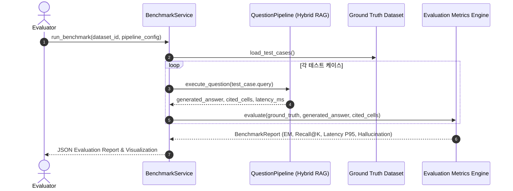

# [SEC-501] 정량적 벤치마크 평가 하네스 및 목표 KPI 검증 계획
> **Chapter:** 5. 품질 검증 및 결론 | **Section:** 5.1 | **Status:** Approved Baseline  
> **Classification:** Quantitative Benchmark Evaluation Harness, Ground-Truth Dataset & Target KPIs

---

## 1. 벤치마크 평가 하네스 아키텍처 (Evaluation Harness)

---

## 2. 4대 평가 메트릭 및 목표 기준

1. **Exact Match (EM)**: 수치 및 단위가 완벽히 일치하는 비율 (목표: $\ge 95.0\%$).
2. **Ground-Truth Cell Recall@5**: 실제 정답 셀이 상위 5개 RRF 검색 후보에 포함되는 비율 (목표: $\ge 98.0\%$).
3. **Fast RAG P95 Latency**: 단일 질의응답 95백분위 처리 시간 (목표: $< 500	ext{ms}$).
4. **Hallucination Rate**: 잘못된 수식을 사용하거나 허위 숫자를 인용한 비율 (목표: $0.0\%$).