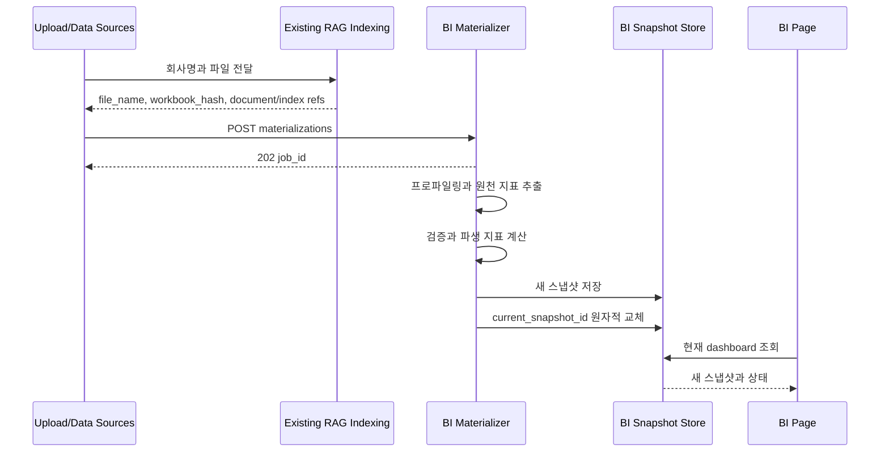

# BI 디자인-데이터 연결 계획서

## 1. 문서 역할

이 문서는 [BI_DESIGN_PLAN.md](./BI_DESIGN_PLAN.md)의 화면과 [BI_CONTENT_PLAN.md](./BI_CONTENT_PLAN.md)의 지표 스냅샷을 실제 서비스로 연결하는 실행 순서, API 계약, 상태 동기화, QA 기준을 정의한다.

사용자가 원하는 제작 순서를 그대로 따른다.

1. 공통 데이터 계약만 먼저 고정
2. fixture 기반 디자인 구현
3. 지표 추출 및 스냅샷 구현
4. 프론트 API 연결
5. 통합 QA

계약 고정은 디자인보다 먼저 수행하지만 화면이나 백엔드 기능을 만드는 단계는 아니다. 실제 제작은 디자인을 먼저 완료하고 내용 및 연결을 함께 진행한다.

## 2. 서비스 경계

### 2.1 BI가 소유하는 것

- 기업 목록과 현재 BI 스냅샷 조회
- 5개 기본 카드와 공통 기간 선택
- 카드 배치, 크기, 숨김 설정
- RAG 기반 지표 materialization 시작 및 상태 조회
- 새 스냅샷의 원자적 게시
- 지표 근거 위치와 챗봇 질문 컨텍스트 전달

### 2.2 BI가 소유하지 않는 것

- 파일 선택 및 업로드 UI
- 기업명 자동 추출 및 확인 화면
- 사용자 인증 및 서버 기반 개인 레이아웃
- 기업 간 비교
- 데이터 수정용 검수 화면
- 투자 판단이나 예측

업로드 또는 데이터 소스 기능은 BI 작업을 시작할 때 `company_id`, 사용자가 입력한 기업명, 파일과 인덱스 식별자를 제공해야 한다. 현재 저장소에는 업로드 API가 없으므로 이 계약은 BI 연결의 선행 의존성으로 명시한다.

## 3. 공통 계약 고정

디자인 fixture와 백엔드 응답이 같은 필드명을 사용한다. 백엔드 Pydantic 모델이 최종 기준이며 프론트는 신뢰 경계에서 런타임 검증한다.

### 3.1 식별자

- `company_id`: 업로드 시스템이 발급하는 안정적인 회사 식별자
- `workbook_hash`: 파일 콘텐츠 버전
- `snapshot_id`: 회사, 해시, 카탈로그 버전, 계산식 버전의 결과 버전
- `job_id`: 한 번의 materialization 작업
- `period_id`: 스냅샷 안에서 안정적인 기간 식별자
- `metric_id`: 지표 카탈로그의 안정적인 지표 식별자

표시명이나 파일명을 식별자로 사용하지 않는다.

### 3.2 대시보드 응답

API는 화면 카드 모양을 반환하지 않고 기간과 지표 시리즈를 반환한다. 프론트의 `cardRegistry`가 지표를 카드에 배치하므로 나중에 카드를 추가해도 백엔드 응답이 특정 레이아웃에 종속되지 않는다.

```json
{
  "schema_version": 1,
  "company": {
    "company_id": "company-id",
    "display_name": "기업명"
  },
  "snapshot": {
    "snapshot_id": "snapshot-id",
    "workbook_hash": "64-char-hash",
    "status": "ready",
    "generated_at": "2026-08-18T00:00:00Z",
    "catalog_version": "1",
    "formula_version": "1"
  },
  "refresh": {
    "status": "idle",
    "job_id": null,
    "started_at": null,
    "message": null
  },
  "periods": [],
  "metrics": {},
  "issues": []
}
```

`metrics`는 `metric_id`를 키로 하는 읽기 전용 맵이다. 각 시리즈는 값 종류, 통화, 배율, 관측값, 상태를 포함한다. 각 관측값에는 화면의 근거 보기에 필요한 evidence가 포함된다.

### 3.3 지표 상태와 카드 상태 매핑

| 백엔드 상태 | 화면 처리 |
|---|---|
| `available` | 값과 차트 표시 |
| `missing` | `데이터 없음` |
| `ambiguous` | `확인 필요`, 근거 보기 제공 |
| `invalid` | `데이터를 표시할 수 없음` |
| `not_meaningful` | `계산 의미 없음`과 이유 표시 |

카드에 필요한 지표가 일부만 `available`이면 사용 가능한 내용은 표시하고 카드 상태를 부분 완료로 표시한다. 카드 위치는 유지한다.

## 4. API 계약

### 4.1 기업 목록

```http
GET /api/bi/companies
```

응답에는 탭에 필요한 회사 정보와 현재 스냅샷 요약만 넣는다.

```json
{
  "companies": [
    {
      "company_id": "company-id",
      "display_name": "기업명",
      "current_snapshot_id": "snapshot-id",
      "snapshot_status": "ready",
      "refresh_status": "idle",
      "updated_at": "2026-08-18T00:00:00Z"
    }
  ]
}
```

정렬은 최근 선택이 아니라 안정적인 등록 순서 또는 기업명 순서 중 하나를 서버에서 고정한다. V1은 등록 순서를 권장한다.

### 4.2 현재 대시보드 스냅샷

```http
GET /api/bi/companies/{company_id}/dashboard
```

- 현재 게시된 스냅샷과 현재 갱신 상태를 함께 반환한다.
- 게시된 스냅샷이 없고 작업 중이면 `202`와 작업 상태를 반환하거나, 명확한 처리 중 응답 모델을 사용한다.
- 등록되지 않은 기업은 `404`다.
- 응답에는 `ETag`로 `snapshot_id`를 사용할 수 있다.
- 기간 필터는 V1에서 프론트가 수행하므로 서버는 전체 기간을 반환한다.

### 4.3 materialization 시작

```http
POST /api/bi/materializations
```

이 엔드포인트는 업로드 UI가 아니라 인덱싱 완료 후 호출하는 내부 연결 경계다.

```json
{
  "company_id": "company-id",
  "display_name": "기업명",
  "source": {
    "file_name": "company.xlsx",
    "workbook_hash": "64-char-hash",
    "document_artifact_id": "document-artifact-id",
    "index_id": "index-id"
  }
}
```

- 같은 기업의 같은 해시와 같은 버전 결과가 이미 있으면 기존 작업 또는 스냅샷을 반환한다.
- 다른 해시는 새 작업을 만든다.
- 정상 접수는 `202 Accepted`와 `job_id`를 반환한다.
- 파일 시스템 절대 경로를 요청으로 받지 않는다.

### 4.4 작업 상태

```http
GET /api/bi/materializations/{job_id}
```

```json
{
  "job_id": "job-id",
  "company_id": "company-id",
  "workbook_hash": "64-char-hash",
  "status": "extracting",
  "completed_requests": 12,
  "total_requests": 48,
  "published_snapshot_id": null,
  "error_code": null,
  "message": "지표를 추출하고 있습니다.",
  "started_at": "2026-08-18T00:00:00Z",
  "updated_at": "2026-08-18T00:01:00Z"
}
```

내부 예외 메시지, prompt, 원본 셀 전체를 응답하지 않는다.

## 5. 업로드부터 화면 게시까지



같은 기업의 기존 스냅샷이 있으면 새 작업 중에도 계속 반환한다. 새 작업이 `ready` 또는 `partial`이면 새 스냅샷으로 교체하고, `failed`면 기존 스냅샷을 유지한다.

## 6. 프론트 데이터 계층

권장 파일은 다음과 같다.

```text
frontend/src/features/bi/
├── types.ts
├── schemas.ts
├── services/
│   └── api.ts
└── hooks/
    ├── useBiCompanies.ts
    ├── useBiDashboard.ts
    └── useBiLayout.ts
```

### 6.1 타입과 파싱

- API 응답은 `schemas.ts`에서 런타임 파싱한다.
- 파싱 후 내부 타입은 읽기 전용 속성과 식별 가능한 상태 union을 사용한다.
- `unknown` 응답을 타입 단언으로 통과시키지 않는다.
- 예상하지 못한 status는 일반 오류로 숨기지 말고 계약 오류로 구분한다.
- 날짜, Decimal 문자열, metric map을 화면에서 사용하기 전에 정규화한다.

### 6.2 요청 동작

- 기업 목록은 BI 페이지 진입 시 한 번 조회한다.
- 기본 선택은 마지막으로 선택한 유효 회사, 없으면 첫 회사다.
- 회사 변경 시 이전 요청은 `AbortSignal`로 취소한다.
- 현재 회사의 dashboard 요청만 화면 상태를 갱신한다.
- refresh가 진행 중이면 기존 스냅샷을 표시하고 작업 상태만 주기적으로 갱신한다.
- 성공 게시를 확인하면 dashboard를 한 번 다시 가져오고 polling을 중단한다.
- 실패 시 polling을 중단하고 기존 스냅샷 위에 비차단 오류를 표시한다.

실시간 스트리밍은 V1 범위가 아니다. 짧은 polling과 점진적 backoff를 사용하며 브라우저가 숨겨졌을 때 불필요한 polling을 줄인다.

## 7. 카드 레지스트리와 지표 연결

`cardRegistry.ts`는 다음을 한 곳에서 정의한다.

- `card_id`
- 제목과 설명
- 필요한 `metric_id` 목록
- 기본 크기와 허용 크기
- 크기별 렌더러
- 데이터가 일부 또는 전부 없을 때의 상태 결정 함수

기본 연결은 다음과 같다.

| 카드 ID | 필요한 지표 |
|---|---|
| `revenue_growth` | `revenue`, `revenue_yoy_growth` |
| `profitability` | `operating_income`, `operating_margin`, `net_income`, `net_margin` |
| `cash_flow` | `operating_cash_flow`, `capital_expenditure`, `free_cash_flow` |
| `stability` | `cash_and_short_term_investments`, `total_debt`, `net_debt` |
| `financial_scale` | `total_assets`, `total_liabilities`, `total_equity` |

컴포넌트 안에서 문자열 metric ID를 반복하지 않는다. 등록되지 않은 지표는 무시하되 개발 환경에서 계약 오류를 확인할 수 있게 한다.

## 8. 기간 필터 연결

- `최근 3개`: 최신 FY 최대 3개와 별도 LTM 대표값
- `최근 5개`: 최신 FY 최대 5개와 별도 LTM 대표값
- `전체`: 모든 FY와 별도 LTM
- 정렬은 `ordinal`과 종료일 정책을 사용한다.
- LTM과 FY 중복 제거는 공통 selector에서 한 번 수행한다.
- 카드별로 기간 정렬이나 중복 제거를 다시 구현하지 않는다.

## 9. 레이아웃 저장

V1은 브라우저 localStorage를 사용하며 모든 기업에 공통으로 적용한다.

- 키: `rag-flow:bi-layout:v1`
- 저장 내용: `schema_version`, 카드 순서, 그리드 위치, S/M/L, 숨김 카드
- 저장하지 않는 내용: 회사 ID, 기간별 값, 스냅샷 데이터
- 로드 시 `cardRegistry`와 대조해 잘못된 카드, 중복 카드, 범위를 벗어난 크기를 정규화한다.
- storage 사용이 불가능하거나 JSON이 손상되면 기본 배치를 사용한다.
- `기본 배치로 초기화`는 해당 키만 제거하고 다른 App Shell 설정은 건드리지 않는다.

향후 인증이 도입되면 같은 스키마를 사용자 설정 API로 옮긴다. V1에서 서버 저장을 미리 만들지 않는다.

## 10. 근거 보기와 챗봇 연결

### 10.1 근거 보기

- 차트 점 또는 핵심 수치에서 evidence를 열 수 있다.
- 최소 정보: 시트명, 셀 좌표, 원본 표시값, 파일 버전.
- 기존 `/api/spreadsheet-artifacts/{workbook_hash}/sheets/{sheet_name}`를 사용해 시트 이미지를 열 수 있다.
- 근거가 여러 개면 계산 입력과 원천 셀을 구분한다.
- evidence가 없는 계산값은 표시하지 않는다. 파생값은 사용한 원천 관측값을 연결한다.

### 10.2 챗봇에 질문

카드 또는 차트에서 `챗봇에 질문`을 선택하면 `/playground`로 다음 컨텍스트를 전달한다.

- `company_id`
- `file_name`
- `workbook_hash`
- 선택한 `metric_id`
- 선택한 `period_id`
- 쉬운 기본 질문 문장

현재 라우터는 pathname만 처리하므로 구현 전에 navigation state 또는 search parameter를 안전하게 지원하도록 `frontend/src/app/router.tsx` 계약을 확장한다. Playground는 전달된 회사의 문서 및 인덱스 값을 선택하고 질문 입력을 미리 채운다. 사용자가 실행하기 전에는 RAG 질의를 자동 전송하지 않는다.

## 11. 백엔드 조립

### 11.1 라우터

- `backend/api/bi_routes.py`를 만들고 `create_api_router`에서 등록한다.
- 라우트는 Pydantic request 및 response model을 명시한다.
- BI 도메인 오류를 404, 409, 422, 500 계열로 구분한다.
- FastAPI OpenAPI 태그에 `BI`를 추가한다.

### 11.2 작업 실행

V1은 파일 기반 작업 상태와 애플리케이션 내부 worker를 사용할 수 있다. 다음 제한을 명시한다.

- 서버 재시작 시 `running` 작업을 `failed` 또는 재실행 가능 상태로 복구한다.
- 게시된 스냅샷은 작업 실패와 무관하게 보존한다.
- 같은 회사와 해시에 대한 중복 동시 작업을 막는다.
- background 예외를 삼키지 않고 작업 상태에 안전한 오류 코드만 남긴다.

다중 서버와 durable queue는 V1 범위 밖이며, 운영 환경으로 확장할 때 교체해야 하는 허용된 기술 부채로 `docs/backend_module_architecture.md`에 기록한다.

## 12. 실제 구현 순서

### 계약 고정

1. 백엔드 Pydantic 스냅샷 모델 초안을 작성한다.
2. 같은 JSON을 프론트 schema 및 fixture에 사용한다.
3. 지표 ID, 상태 집합, 기간 정렬, evidence 구조를 세 문서와 대조한다.

### 디자인

4. [BI_DESIGN_PLAN.md](./BI_DESIGN_PLAN.md)를 fixture로 완료한다.
5. 카드 레지스트리, 기간 selector, 레이아웃 저장을 실제 계약 형태로 구현한다.
6. 디자인 수동 QA가 끝나기 전에는 실제 API를 연결하지 않는다.

### 내용 및 연결

7. [BI_CONTENT_PLAN.md](./BI_CONTENT_PLAN.md)의 구조화 추출, 계산, 저장소를 구현한다.
8. 기업 목록, dashboard, materialization, job API를 구현한다.
9. BI 프론트 service와 hooks를 구현하고 fixture provider를 API provider로 교체한다.
10. 갱신 중 이전 스냅샷 유지와 성공 시 교체를 연결한다.
11. 근거 보기와 수동 챗봇 handoff를 연결한다.
12. route 상태를 `planned`에서 `ready`로 바꾼다.

### 검증

13. 백엔드 단위 및 API 테스트를 실행한다.
14. 프론트 typecheck와 build를 실행한다.
15. 실제 브라우저에서 통합 시나리오를 수행한다.
16. 외부 LLM 통합은 사용자 승인을 받은 경우에만 별도 실행한다.

## 13. 통합 QA 시나리오

### 13.1 다중 기업

- 기업 A와 B가 탭에 표시된다.
- 한 번에 한 기업만 선택된다.
- 기업 간 비교 UI가 없다.
- 기업을 바꿔도 같은 카드 배치가 유지된다.
- 각 기업의 데이터와 evidence가 섞이지 않는다.

### 13.2 신규 및 재업로드

- 최초 기업은 처리 중 상태에서 시작해 성공 후 카드가 나타난다.
- 기존 기업의 새 파일 처리 중에는 이전 카드와 값을 계속 볼 수 있다.
- 새 작업 성공 시 새 snapshot ID와 값으로 한 번만 교체된다.
- 새 작업 실패 시 이전 스냅샷을 유지하고 실패 메시지만 표시한다.
- 부분 완료 스냅샷은 준비된 카드와 부족한 카드 상태를 함께 표시한다.

### 13.3 기간과 결측

- 2개 FY만 있는 회사에서 3개나 5개를 강제로 만들지 않는다.
- LTM이 없는 회사는 최신 FY를 대표값으로 사용한다.
- LTM과 FY0이 중복이면 막대가 하나만 보인다.
- `NA`, `NM`, `null`, `ambiguous`가 0으로 표시되지 않는다.
- 통화나 배율이 다른 값을 한 차트에 섞지 않는다.

### 13.4 배치

- 드래그, 리사이즈, 카드 숨김 및 복구가 동작한다.
- 새로고침 및 기업 전환 후 배치가 유지된다.
- 모바일에서는 한 열 순서 변경과 메뉴 기반 크기 변경이 동작한다.
- 손상된 localStorage는 기본 배치로 복구된다.

### 13.5 근거와 챗봇

- 표시된 값에서 올바른 회사, 해시, 시트, 셀 evidence를 볼 수 있다.
- 파생 지표는 계산에 사용한 원천 evidence를 표시한다.
- `챗봇에 질문`은 올바른 회사 파일과 질문을 Playground에 전달한다.
- Playground 진입만으로 질문을 자동 실행하지 않는다.

### 13.6 실패 및 접근성

- 기업 목록 실패, dashboard 실패, 작업 상태 실패를 서로 다른 메시지로 표시한다.
- 키보드만으로 기업 탭, 기간, 카드 조작, 근거 보기를 사용할 수 있다.
- 375px, 768px, 1280px에서 가로 페이지 스크롤이 없다.
- reduced motion에서 카드 이동 애니메이션이 제거된다.

## 14. 검증 명령

현재 프로젝트의 도구에 맞춰 최소한 다음을 실행한다.

```bash
python -m backend.tools.generate_module_docs
python -m unittest discover -s tests
cd frontend
npm run typecheck
npm run build
```

프론트 테스트 도구를 추가했다면 레이아웃 정규화, 기간 selector, API schema parsing 테스트도 실행한다. 명령 성공만으로 완료 처리하지 않고 브라우저 수동 QA 결과를 함께 남긴다.

## 15. 외부 API 승인 게이트

실제 업로드 파일로 materialization을 실행하면 파일의 재무 셀, 검색 질문, 검색 컨텍스트가 외부 LLM 또는 임베딩 provider로 전송될 수 있다.

- fake provider와 fixture를 사용하는 구현 및 테스트는 바로 수행할 수 있다.
- 실제 외부 API 호출 전에는 전송 범위와 provider를 사용자에게 알리고 승인을 받는다.
- 승인되지 않은 상태에서는 실제 파일 통합 QA를 외부 호출 없이 중단하고, 남은 검증 항목을 명시한다.

## 16. 전체 완료 조건

- 디자인, 내용, 연결 세 문서의 지표 ID와 상태 계약이 일치한다.
- 5개 기본 카드가 실제 스냅샷 데이터로 렌더링된다.
- 기업 탭, 공통 기간 선택, 공통 레이아웃이 동작한다.
- 새 파일 처리 중 이전 스냅샷이 유지되고 성공 후 원자적으로 교체된다.
- 모든 표시 값은 구조화 관측값 또는 결정적 계산 결과이며 근거를 추적할 수 있다.
- 페이지 로드가 RAG를 호출하지 않는다.
- 결측 및 모호한 값을 0으로 바꾸지 않는다.
- 백엔드 테스트, 프론트 typecheck 및 build, 통합 수동 QA가 완료된다.
- 실제 외부 API 호출 여부와 승인 상태가 결과 보고에 명시된다.

